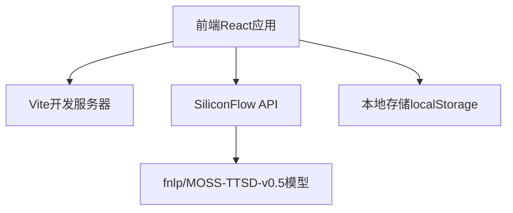

## 1. Architecture Design

## 2. Technology Description
- 前端: React@18 + TypeScript + tailwindcss@3 + vite
- 初始化工具: vite-init
- 后端: 无需后端，直接调用SiliconFlow API
- 数据存储: localStorage存储API密钥
- 图标库: lucide-react

## 3. Route Definitions
| Route | Purpose |
|-------|---------|
| / | 主页面，包含所有TTS功能 |

## 4. API Definitions (if backend exists)
不适用，直接调用SiliconFlow官方API

## 5. Server Architecture Diagram (if backend exists)
不适用

## 6. Data Model (if applicable)
### 6.1 Data Model Definition
不适用

### 6.2 Data Definition Language
不适用
