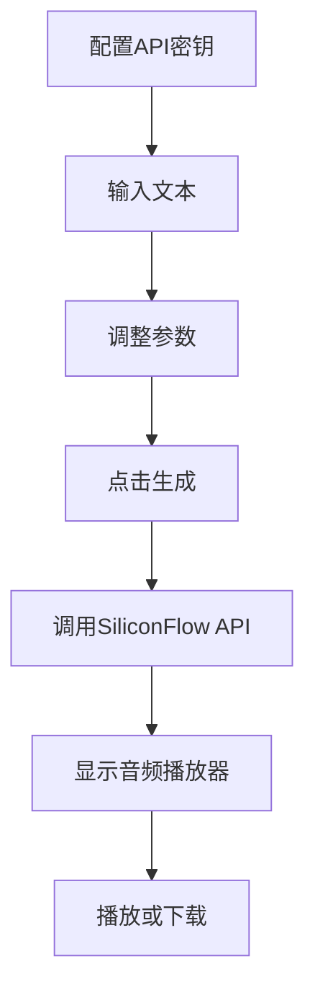

## 1. Product Overview
这是一个基于SiliconFlow API的文本转语音（TTS）网站，默认使用fnlp/MOSS-TTSD-v0.5模型，为用户提供简单直观的文本到音频转换功能。
- 目标是为用户提供一个美观、易用的TTS工具，支持多种配置选项
- 主要价值在于提供高质量的语音合成服务，支持多说话人、情感表达等功能

## 2. Core Features

### 2.1 User Roles (if applicable)
| Role | Registration Method | Core Permissions |
|------|---------------------|------------------|
| Normal User | No registration required | 使用所有TTS功能 |

### 2.2 Feature Module
1. **主页面**: API密钥配置、文本输入、参数调整、音频生成与播放
2. **历史记录**: 保存最近的生成记录（可选）

### 2.3 Page Details
| Page Name | Module Name | Feature description |
|-----------|-------------|---------------------|
| 主页面 | API密钥配置 | 允许用户输入和保存SiliconFlow API密钥 |
| 主页面 | 文本输入 | 支持大文本输入，支持[S1][S2]标记切换说话人 |
| 主页面 | 参数控制 | 调节语速、音量、输出格式等 |
| 主页面 | 音频生成 | 调用SiliconFlow API生成语音 |
| 主页面 | 音频播放 | 在线播放生成的音频，支持下载 |

## 3. Core Process
用户首先输入API密钥，然后输入要转换的文本，调整参数后点击生成按钮，系统调用SiliconFlow API生成音频，最后在页面上显示播放控件供用户播放或下载。

## 4. User Interface Design
### 4.1 Design Style
- 主色调：深蓝色（#1e3a8a）配天蓝色（#38bdf8）
- 按钮风格：圆角矩形，有悬停和点击效果
- 字体：无衬线现代字体，标题加粗
- 布局风格：卡片式布局，内容居中
- 图标：使用Lucide图标库

### 4.2 Page Design Overview
| Page Name | Module Name | UI Elements |
|-----------|-------------|-------------|
| 主页面 | API密钥配置 | 输入框，保存按钮，提示文字 |
| 主页面 | 文本输入 | 大文本域，字数统计 |
| 主页面 | 参数控制 | 滑块控件，下拉选择框 |
| 主页面 | 生成按钮 | 醒目按钮，加载状态 |
| 主页面 | 音频播放器 | 原生音频控件，下载按钮 |

### 4.3 Responsiveness
桌面优先，自适应移动设备，触摸友好的控件尺寸

### 4.4 3D Scene Guidance (if applicable)
不适用
